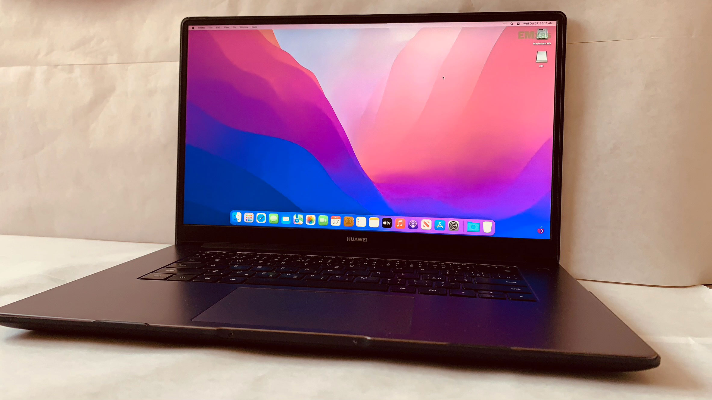

# Huawei Matebook D15 2020 Hackintosh

This repository provides instructions and resources for running macOS on the Huawei Matebook D15 2020, creating a Hackintosh setup. Please note that the process of installing macOS on non-Apple hardware, known as Hackintosh, may have compatibility and stability limitations.

## Specifications

- **Model**: Huawei Matebook D15 2020 (BOHB-WAX9)
- **Processor**: Intel Core i3-10110U @ 2.10GHz
- **Graphics**: Intel UHD Graphics
- **RAM**: 8GB
- **Storage**: 256GB SSD
- **Wireless**: Intel Wireless-AC 9560 160MHz
- **Audio**: Everest ES8316 (Not supported)

## Prerequisites

Before attempting to install macOS on your Huawei Matebook D15 2020, make sure you have the following:

- A USB flash drive (minimum 16GB) for creating the macOS installer.
- The latest version of the [OpenCore](https://github.com/acidanthera/OpenCorePkg) bootloader.
- A macOS installation image downloaded from the Apple App Store or other [reliable sources](https://dortania.github.io/OpenCore-Install-Guide/installer-guide/#making-the-installer).

## Installation Steps

1. [Create a bootable macOS installer](https://dortania.github.io/OpenCore-Install-Guide/installer-guide/#making-the-installer) on the USB flash drive.
2. Copy the EFI folder from this GitHub repository to the root of the USB flash drive.
3. Boot the USB and install macOS. If you encounter any issues, refer to the [troubleshooting guide](https://dortania.github.io/OpenCore-Install-Guide/troubleshooting/troubleshooting.html#table-of-contents).
4. After installing macOS, follow these additional guides:
   - [Booting without USB](https://dortania.github.io/OpenCore-Post-Install/universal/oc2hdd.html)
   - [Enabling iServices](https://dortania.github.io/OpenCore-Post-Install/universal/iservices.html)
   - For any other issues, refer to the [OpenCore Post-Install guide](https://dortania.github.io/OpenCore-Post-Install/#how-to-follow-this-guide)

## Known Issues

- Audio may not work due to lack of support for the Everest ES8316 audio card.

## Contributing

Contributions are welcome to improve the compatibility and functionality of macOS on the Huawei Matebook D15 2020 Hackintosh setup. Please follow the guidelines and contribute responsibly.